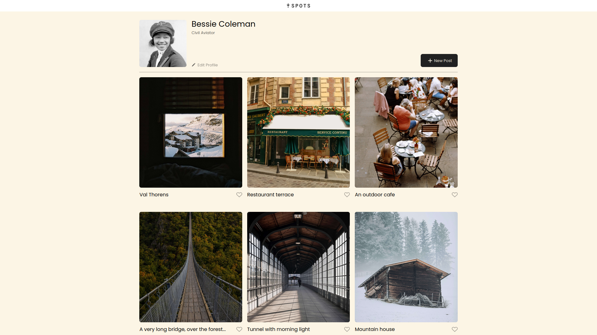

# Project 3: Spots

## 📌 Overview

Spots is a responsive web project designed to ensure that all elements are displayed correctly across various screen sizes. This project is more challenging than previous ones, so take your time to refine and optimize your implementation!

## 🎯 Objectives

- Implement a fully responsive layout using HTML & CSS.
- Ensure compatibility with popular screen sizes.
- Improve workflow efficiency using Git and the terminal.
- Optimize images for faster loading times.

## 🖼️ Images



### 🔹 Best Practices:

- Export assets from Figma.
- Optimize images to reduce file size while maintaining quality.
- Use web-friendly formats like `.jpg`, `.png`, and `.webp`.

## 💻 Technologies Used

- HTML5 – Structuring the content.
- CSS3 – Styling and making the site responsive.
- Git & Terminal – Version control and efficient project management.

## A video about the project in Google drive

- https://drive.google.com/file/d/1Xpt2qw6X0Hd-aWaZ7hoMZGJ3587QnFO5/view?usp=sharing

## 🚀 How to Run the Project

1. Clone the repository:
   ```sh
   git clone https://github.com/moisesJduarte/se_project_spots.git
   ```
2. Navigate into the project directory:
   ```sh
   cd spots-project
   ```
3. Open the project in your browser:
   - Open `index.html` manually, or use a local server.
   - If using VS Code, install the Live Server extension and click "Go Live".

## 🛠️ Key Features

✅ Fully responsive design for various screen sizes. ✅ Modern layout inspired by Figma guidelines. ✅ Image optimization for improved performance. ✅ Clean and maintainable CSS structure.

## 📌 Responsive Breakpoints

| Screen Size    | Layout Behavior                  |                     |
| -------------- | -------------------------------- | ------------------- |
|                | 1320px                           | Full desktop layout |
| 880px - 1320px | Two cards per row                |                     |
| 630px - 880px  | One card per row                 |                     |
| Below 630px    | Stacked layout for small screens |                     |

## 🎉 Good Luck & Have Fun!

Happy coding! 🚀
